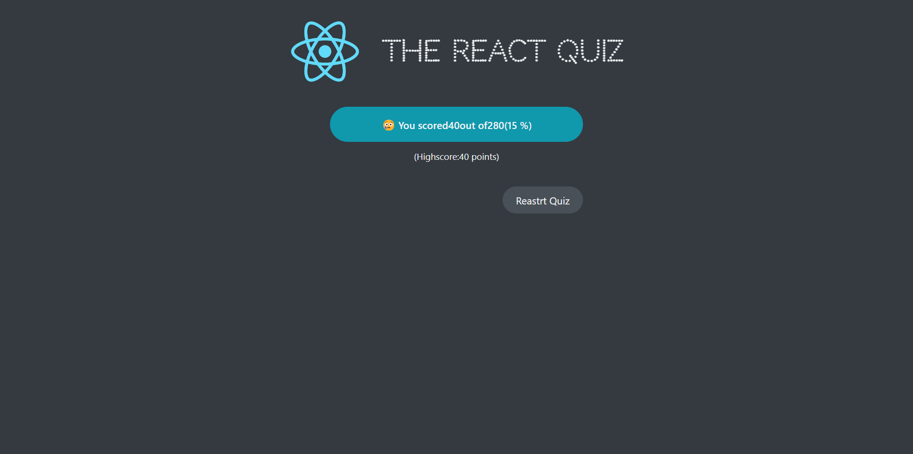

# React Project Collection

Welcome to the React Project Collection, a series of demos and projects developed as part of a learning journey in React. This repository contains code that I have practiced based on Udemy's Jonas Schmedtmann's React course（ https://www.udemy.com/course/the-ultimate-react-course/ ）, which I highly recommend as the best React course I've ever taken.

## Projects

Here's a brief overview of the projects included in this collection:

0. Pizza Ordering Demo: Components, Props, JSX

1. Steps Card Demo

2. Travelling TodoList Demo: State, Events, Forms. Allow users to add/delete items, choose the item number, sort the items, clear list, show the progress

3. Split Bill Demo: Lift State up, State Management. Allow users to add friends and split bill

4. UsePopcorn Website: Prop Drilling, Components Reusability, PropTypes, Star Rating, Search Query, Select Movies, UseEffect hooks, useRef hooks, handle click events, destruct object, Cleanup Function, Data Fetching, localStorage, custom hooks

5.
6. the React Quiz: A quiz website including progress bar, timer, questions and answers.use JSON file to create fake API, use useEffect to fetch data, use useReducer to manage and dispatch complex states.

7. 
